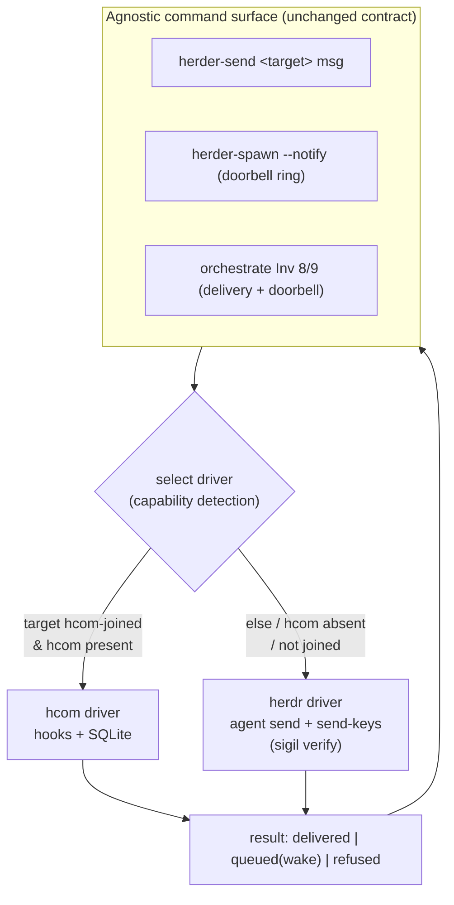

# feat: Pluggable delivery-driver substrate for herder — hcom as the first non-native driver

## Summary

Herder's peer-messaging and completion-doorbell mechanics are hardwired to one transport: `herdr agent send` + `pane send-keys Enter`, with a sigil-heuristic to guess whether delivery landed. That keystroke transport is the brittle part — delivery into a non-active pane silently fails (killed relay v1), and "did it submit?" is inferred from screen-scraping. This plan introduces a **delivery-driver abstraction**: herder's commands (`herder-send`, `herder-spawn --notify`, the orchestrate doorbell) express *intent* against a small driver interface and stay technology-agnostic. The current keystroke logic becomes an explicit `herdr` driver (the always-available fallback); **hcom** (github.com/aannoo/hcom — hooks + local SQLite, no keystrokes) becomes a second driver selected by capability detection. hcom's hook-based delivery removes the silent-pane-drop failure mode and turns the "queued" guess into a real mid-turn injection / idle-wake.

The work is gated: a **characterization spike phase (U1–U5)** verifies hcom's real behavior on this machine *before* any integration code is written, and its findings are a go/no-go for the integration phase. Turn arbitration and write-contention are explicitly **out of scope** — they remain orchestrate's "one writer per worktree" invariant.

**Product Contract preservation:** direct plan (no upstream brainstorm); scope authored here from the research decisions carried in the origin request.

---

## Problem Frame

Herder is the substrate the `orchestrate` skill runs on. Two of its invariants are the brittle load-bearing mechanics:

- **Invariant 8 (delivery verified, not assumed):** "delivery into a non-active pane in a crowded tab silently fails — this killed relay v1." Delivery today = `herdr agent send` (writes literal text, no Enter) + `pane send-keys Enter`, then a sigil re-read to guess success. It is a screen-scrape, not an ack.
- **Invariant 9 (completion is a doorbell, not a poll):** a finished worker rings the orchestrator with a one-line `herder-send`; a busy orchestrator only *queues* the ring (`verify=queued`), and the ring is best-effort, so a bounded `herder-wait` backstop exists to catch drops.

Both are heroic engineering *around* a keystroke transport that has no delivery semantics. hcom provides exactly the missing semantics — delivery via harness hooks + SQLite (no silent drop), mid-turn injection at tool boundaries, and idle-wake — and does so cross-harness (Claude Code + Codex both automatic). But hcom must be **adopted without coupling herder's command surface to it**: the commands should keep working with zero hcom present, and hcom should slot in as one driver among potentially several.

The design tension the plan resolves: get hcom's robustness where it helps (Inv 8/9) while keeping `herder-send`/`--notify`/the doorbell **transport-agnostic** and the `herdr` keystroke path as a first-class always-present fallback.

---

## Requirements

- **R1** — Herder's message-delivery and doorbell commands MUST be technology-agnostic: no command name, flag, or user-facing contract may reference `hcom` specifically. Transport is selected internally.
- **R2** — A `herdr`-native keystroke driver MUST remain the always-available fallback with byte-for-byte the current behavior (resolution by `terminal_id`, sigil verification, `verify=queued` on busy, codex large-paste handling, exit codes 0/1/2/64).
- **R3** — An `hcom` driver MUST deliver peer messages and doorbell rings via hcom when both peers are hcom-joined, replacing keystroke delivery on that path.
- **R4** — Driver selection MUST be automatic via capability detection, with a deterministic fallback to `herdr` when hcom is absent, not installed, or the target agent has not joined the bus. An explicit override MUST exist.
- **R5** — The existing `herder-send` public contract (target forms, exit codes, `--json`, `--dry-run`, `verify=queued` semantics) MUST be preserved across both drivers so `orchestrate` and spawned agents are unaffected.
- **R6** — `herder-spawn` MUST be able to join a spawned agent to the active bus in a transport-neutral way (driver decides what "join" means; `herdr` driver = no-op).
- **R7** — The `herder` and `orchestrate` SKILL.md docs MUST describe the driver abstraction and the fallback, without pinning the invariants to keystroke specifics.
- **R8** — Integration units MUST be gated on the spike phase (U1–U5) findings; a failing spike blocks the corresponding integration path rather than proceeding on assumption.
- **R9** — Out of scope, documented as such: turn arbitration and enforced write-contention. hcom's collision *notification* MAY be surfaced but MUST NOT be relied on as a lock.

---

## High-Level Technical Design

The command surface calls a thin **driver interface**; drivers implement it. `herder-send` already wraps raw herdr sends with verification, so its exit-code contract *is* the interface contract — this plan makes that boundary explicit and adds a second implementation.



**Interface contract (four operations, mapped to today's semantics):**

| Op | Meaning | `herdr` driver | `hcom` driver |
|---|---|---|---|
| `resolve(target)` | target → live address, drift-proof | registry/`terminal_id` → current `pane_id` | target → hcom instance name (name == herder label, per herdr preset) |
| `send(target,msg)` | deliver, return `delivered\|queued\|failed\|refused` | agent send + Enter + sigil re-read | `hcom send`; hook injects mid-turn or wakes idle |
| `ring(target,msg)` | best-effort doorbell | one-line `herder-send` (queues if busy) | `hcom send` / subscription event |
| `join(agent)` | attach agent to bus (spawn-time) | no-op | run `hcom start` in the child |

**Selection & fallback (deterministic):** `hcom` is chosen only when hcom is on PATH AND the target resolves to a joined hcom instance; any negative → `herdr`. Env/config override forces a driver (e.g. `HERDER_BUS=herdr|hcom|auto`, default `auto`). The `herdr` driver must never require hcom, so a machine with no hcom behaves exactly as today.

**Why the contract maps cleanly:** herder-send's `verify=queued` (busy target, message accepted to run next) is conceptually hcom's mid-turn-injection/idle-wake — both mean "accepted, will process at the next boundary." Exit 2 (target gone/refused) maps to hcom "instance not found / not joined." This is why hcom slots under the *same* return contract without changing callers.

---

## Output Structure

New/changed layout (integration phase; spike phase writes only a findings doc):

```
skills/herder/scripts/
  lib/
    delivery-driver.sh      # NEW: interface + selection/dispatch (sourced by herder-send/-spawn)
    driver-herdr.sh         # NEW: current keystroke logic, extracted behavior-preserving
    driver-hcom.sh          # NEW: hcom driver
  herder-send               # MODIFIED: dispatch through delivery-driver.sh
  herder-spawn              # MODIFIED: transport-neutral bus-join on spawn
skills/herder/references/
  delivery-drivers.md       # NEW: driver abstraction + contract reference
  spike-findings-hcom.md    # NEW (spike phase): recorded go/no-go findings
skills/herder/SKILL.md      # MODIFIED: document driver abstraction
skills/orchestrate/SKILL.md # MODIFIED: Inv 8/9 reference "the delivery driver"
```

The `lib/` split is a design decision (isolate the interface so a future third driver is additive); the implementer may adjust internal file boundaries if a cleaner split emerges. Per-unit **Files** remain authoritative.

---

## Key Technical Decisions

- **KTD1 — Driver interface, not an hcom flag.** Reject `herder-spawn --hcom` / hcom-named flags (R1). The command surface dispatches to a driver; hcom is invisible to callers. Rationale: keeps orchestrate and every spawned agent decoupled from transport, lets `herdr` stay the fallback, and makes a future driver (e.g. a SQLite bus like agmsg) additive. This is the user's explicit steer and the plan's spine.
- **KTD2 — Reuse `herder-send`'s exit-code contract as the interface.** Don't invent a new return protocol; the existing 0/1/2/64 + `verify=queued` already expresses everything a driver must report (R5). hcom maps onto it rather than the callers changing.
- **KTD3 — Capability-detected selection with hard `herdr` fallback (R4).** Auto by default; `herdr` whenever hcom isn't provably usable for the target. No machine is *required* to have hcom. Explicit `HERDER_BUS` override for spikes/debugging and for forcing the old path.
- **KTD4 — Option B (herder owns spawn); hcom is a pure bus.** Do not let `hcom claude` replace `herder-spawn`. The `herdr` terminal preset in hcom (`herdr agent start {instance_name}` / `herdr pane close {pane_id}`, name-aligned) is used *only* as evidence the two compose; herder remains the launcher and `join()` runs `hcom start` in the already-spawned child.
- **KTD5 — Characterization-first, spike-gated (R8).** The five open questions are unverified maintainer-doc claims (esp. Codex delivery, flagged as the weak link in comparable tools). They become gating units whose findings are recorded before integration; a red spike blocks its path, it does not get coded around.
- **KTD6 — Write-contention stays out (R9).** hcom's 30s same-file collision ping is *notification*, not a lock. Do not build arbitration on it; the "one writer per worktree" invariant (orchestrate Inv 7) remains the mechanism. Surfacing the ping as an advisory event is allowed, relying on it is not.

---

## Scope Boundaries

**In scope:** the driver abstraction behind herder's existing message/doorbell commands; a behavior-preserving `herdr` driver; an `hcom` driver; auto-selection + fallback; transport-neutral spawn-join; the spike phase; SKILL.md doc updates for both skills.

**Out of scope (hcom does not solve these — keep them owned where they are):**
- **Turn arbitration** — both subscribers on an hcom channel see the same message; no broker ordering. Unchanged: prompt-level protocol in orchestrate.
- **Enforced write-contention** — remains orchestrate Inv 7 ("one writer per worktree").

### Deferred to Follow-Up Work
- A third driver (e.g. agmsg SQLite bus, or h5i git-log) once the interface is proven — additive, not now.
- hcom **relay** (cross-device) wiring — single-machine only for v1.
- Surfacing hcom's collision event as an orchestrate advisory signal (design after the bus lands).
- hcom subscription-driven doorbell (`auto_subscribe stopped/blocked`) as a richer replacement for the ring — v1 keeps the one-line ring semantics through the driver; subscriptions are an enhancement.

---

## Implementation Units

### Phase 0 — Characterization spikes (GATE: findings recorded before any Phase 1 code)

Each spike unit's deliverable is a recorded finding in `skills/herder/references/spike-findings-hcom.md` (PASS/FAIL + evidence + implication). The phase ends with an explicit go/no-go. These units write no production code.

#### U1. Smoke-test cross-harness push (Claude ↔ Codex)
- **Goal:** Confirm hcom delivers bidirectional mid-turn messages between a Claude and a Codex agent on this machine.
- **Requirements:** R3, R8
- **Dependencies:** none
- **Files:** `skills/herder/references/spike-findings-hcom.md` (create)
- **Approach:** Install hcom (`brew install aannoo/hcom/hcom`). Terminal 1 `hcom claude`, terminal 2 `hcom codex`; prompt one to message the other in hcom; observe delivery mid-turn vs at turn boundary. Record latency and whether delivery is injection or wake.
- **Verification:** Findings doc records PASS/FAIL with the observed delivery timing for each direction.
- **Test expectation:** none — manual characterization spike; evidence is the recorded finding.

#### U2. Verify `herdr` terminal preset + name alignment
- **Goal:** Confirm `hcom --terminal herdr` spawns a real herdr pane and that hcom instance name == herder agent label.
- **Requirements:** R4, R6, R8
- **Dependencies:** U1
- **Files:** `skills/herder/references/spike-findings-hcom.md` (append)
- **Approach:** Launch via the herdr preset; compare `hcom list` against `herdr agent list` / the herder registry; confirm `HERDR_PANE_ID` detection and that `hcom send @<label>` resolves to the same entity herder addresses.
- **Verification:** Findings doc records whether names align 1:1 and whether close/kill map (`hcom kill` → `herdr pane close`).
- **Test expectation:** none — characterization spike.

#### U3. Option-B probe (herder owns spawn; hcom is bus)
- **Goal:** Prove herder-spawned agent + `hcom start` in the child + `hcom send` from the orchestrator works end-to-end, without hcom launching the agent.
- **Requirements:** R4, R6, R8; KTD4
- **Dependencies:** U1
- **Files:** `skills/herder/references/spike-findings-hcom.md` (append)
- **Approach:** `herder-spawn` a normal agent; inside it run `hcom start`; from the orchestrator shell `hcom send -b @<agent> -- <msg>`; confirm the child receives it via hook delivery (not keystrokes). This is the exact integration path U8–U10 will encode.
- **Verification:** Findings doc records whether herder-owned-spawn + hcom-as-bus delivers reliably; note any join races.
- **Test expectation:** none — characterization spike.

#### U4. `HCOM_DIR` per-worktree isolation vs one-writer invariant
- **Goal:** Characterize how `HCOM_DIR`-scoped state interacts with concurrent worktrees and orchestrate Inv 7.
- **Requirements:** R9, R8
- **Dependencies:** U1
- **Files:** `skills/herder/references/spike-findings-hcom.md` (append)
- **Approach:** Set `HCOM_DIR=$PWD/.hcom` in two worktrees; confirm DB/hook isolation per folder; confirm agents in different worktrees don't cross-talk unless intended; note whether a shared bus across worktrees is possible when desired.
- **Verification:** Findings doc states the isolation model and any conflict with one-writer-per-worktree.
- **Test expectation:** none — characterization spike.

#### U5. Codex hook-delivery reliability vs PTY fallback (WEAK-LINK GATE)
- **Goal:** Determine how often Codex delivery uses hooks vs the PTY-injection fallback, and whether it's reliable enough to depend on.
- **Requirements:** R3, R8; KTD5
- **Dependencies:** U1, U3
- **Files:** `skills/herder/references/spike-findings-hcom.md` (append)
- **Approach:** Drive repeated sends to a Codex agent under load (mid-turn, idle, during a long task); log delivery mechanism and any drops/duplicates/orphan-identity issues (research flagged Codex monitor as beta). Compare against the `herdr` keystroke path's reliability for the same cases.
- **Verification:** Findings doc gives a reliability verdict for the Codex hcom path and a recommendation: hcom-for-Codex GO, or Codex-stays-on-herdr-driver for v1.
- **Test expectation:** none — characterization spike.

**GATE:** Summarize U1–U5 into a go/no-go at the top of the findings doc. A FAIL on U5 narrows R3 to Claude-only for v1 (Codex keeps the `herdr` driver) rather than blocking the whole plan. A FAIL on U3 blocks the hcom driver entirely (fall back to docs-only). Record the decision before Phase 1.

---

### Phase 1 — Integration (gated on the Phase 0 go/no-go)

#### U6. Define the delivery-driver interface
- **Goal:** Extract herder-send's implicit delivery contract into an explicit, sourced interface + selection/dispatch shim.
- **Requirements:** R1, R2, R5; KTD1, KTD2
- **Dependencies:** U1–U5 gate = GO
- **Files:** `skills/herder/scripts/lib/delivery-driver.sh` (create), `skills/herder/references/delivery-drivers.md` (create)
- **Approach:** Define the four ops (`resolve`/`send`/`ring`/`join`) and the return contract (map to exit 0/1/2/64 + `verify=queued`). `delivery-driver.sh` exposes a `driver_dispatch <op> <target> [msg]` that selects a driver (U9) and calls into it. No behavior change yet — this is the seam.
- **Patterns to follow:** `skills/herder/scripts/herder-send` header contract (exit codes, target resolution, `--json`/`--dry-run`); the existing symlink-into-`bin/` convention.
- **Technical design:** Directional — `driver_dispatch` reads `HERDER_BUS` (default `auto`), calls `select_driver`, then `${driver}_${op}`. Drivers register by defining `herdr_send`, `hcom_send`, etc.
- **Test scenarios:**
  - `driver_dispatch` routes `resolve/send/ring/join` to the selected driver's function and returns its exit code verbatim.
  - Unknown op → exit 64 (usage), matching herder-send convention.
  - `HERDER_BUS=herdr` forces the herdr driver regardless of hcom presence.
  - Covers R5. Interface returns are byte-identical shape to today's `--json` record.

#### U7. Extract the `herdr` driver (behavior-preserving)
- **Goal:** Move the current keystroke logic (resolution, send+Enter, sigil verify, `verify=queued`, codex large-paste, exit codes) into `driver-herdr.sh` behind the interface, changing no behavior.
- **Requirements:** R2, R5
- **Dependencies:** U6
- **Files:** `skills/herder/scripts/lib/driver-herdr.sh` (create), `skills/herder/scripts/herder-send` (modify to dispatch)
- **Execution note:** Characterization-first — capture current `herder-send --dry-run`/`--json` outputs across the resolution and queued/refused cases as golden fixtures *before* the extract, then refactor to keep them identical.
- **Approach:** Pure refactor. `herder-send` becomes a thin front-end calling `driver_dispatch send`. All sharp-edge handling (pane-id drift via `terminal_id`, busy→queued, codex paste blob, interrupted/modal refuse) lives in the `herdr` driver unchanged.
- **Patterns to follow:** existing `herder-send` internals verbatim; `references/herder-delta.md` sharp-edge notes.
- **Test scenarios:**
  - Golden: `--dry-run` resolution output (guid/label/terminal_id/pane_id forms) identical pre/post refactor.
  - Busy target → `verify=queued`, exit 0, no extra-Enter (unchanged).
  - Gone/interrupted/modal target → exit 2 refuse (unchanged).
  - Codex >1k-char paste → treated as landed, second Enter, no double-composer (unchanged).
  - Covers R2, R5.

#### U8. Add the `hcom` driver
- **Goal:** Implement the interface over hcom.
- **Requirements:** R3; KTD2, KTD4
- **Dependencies:** U6, U7, U3 (GO), U5 (verdict scopes Codex)
- **Files:** `skills/herder/scripts/lib/driver-hcom.sh` (create)
- **Approach:** `hcom_resolve` maps target label → hcom instance (name-aligned per U2). `hcom_send` shells `hcom send`; map hcom accepted-mid-turn / idle-wake → the `delivered`/`queued` return; instance-not-found → exit 2. `hcom_ring` = doorbell send. `hcom_join` runs `hcom start` in the child (used by U10). If U5 verdict is Codex-not-ready, `hcom_resolve` returns "not usable" for codex targets so selection falls back to `herdr`.
- **Test scenarios:**
  - Send to a joined hcom peer → `delivered` (exit 0) via hook path, not keystrokes.
  - Send to a busy peer → `queued` semantics (accepted, wakes/injects next boundary), exit 0.
  - Target not a joined hcom instance → exit 2 (so selection falls back to herdr).
  - Codex target when U5 verdict = not-ready → `hcom_resolve` reports unusable (routes to herdr).
  - Covers R3.

#### U9. Driver selection + fallback
- **Goal:** Implement `select_driver` — auto-detect, deterministic fallback to `herdr`, explicit override.
- **Requirements:** R4; KTD3
- **Dependencies:** U7, U8
- **Files:** `skills/herder/scripts/lib/delivery-driver.sh` (modify)
- **Approach:** `select_driver <target>`: if `HERDER_BUS` set, honor it; else if `command -v hcom` AND `hcom_resolve <target>` says joined-and-usable → `hcom`; else `herdr`. Cache detection per invocation. Never error if hcom absent.
- **Test scenarios:**
  - hcom absent (`command -v hcom` empty) → always `herdr`, no error.
  - hcom present, target joined & usable → `hcom`.
  - hcom present, target not joined → `herdr` fallback.
  - `HERDER_BUS=herdr` overrides even when hcom usable; `HERDER_BUS=hcom` forces hcom (and hard-errors clearly if target unresolvable, for debugging).
  - Covers R4. No path requires hcom for the herdr case (R2).

#### U10. Transport-neutral bus-join on spawn
- **Goal:** Let `herder-spawn` attach a spawned agent to the active bus without naming hcom.
- **Requirements:** R1, R6; KTD1, KTD4
- **Dependencies:** U8, U9, U2/U3 (GO)
- **Files:** `skills/herder/scripts/herder-spawn` (modify)
- **Approach:** After the child settles, `herder-spawn` calls `driver_dispatch join <child>`; the selected driver decides (`hcom_join` runs `hcom start` in the child; `herdr_join` is a no-op). Flag is transport-neutral (e.g. `--bus auto|off`, default `auto`), never `--hcom`. Report join outcome in the spawn summary / `--json`.
- **Test scenarios:**
  - `--bus off` → no join attempted, spawn behaves exactly as today.
  - `--bus auto` + hcom usable → child joined (hcom_join ran); summary reports it.
  - `--bus auto` + hcom absent → herdr no-op join, no error, spawn unchanged.
  - Join failure is non-fatal: spawn still succeeds, reports join-failed, agent reachable via herdr driver.
  - Covers R1, R6.

#### U11. Document the abstraction in `herder` SKILL.md
- **Goal:** Describe the driver abstraction, selection, and fallback in the herder skill; keep command docs agnostic.
- **Requirements:** R7; R1
- **Dependencies:** U6–U10
- **Files:** `skills/herder/SKILL.md` (modify), `skills/herder/references/delivery-drivers.md` (finalize)
- **Approach:** Add a "Delivery drivers" subsection: commands express intent; `herdr` is the always-present fallback; a bus driver (hcom) is auto-selected when present; `HERDER_BUS` override; join-on-spawn is transport-neutral. Update the "Sending to a running peer" and "Notify-back" sections to reference the driver, not keystroke specifics, while preserving the sharp-edge notes as `herdr`-driver behavior.
- **Test expectation:** none — documentation. Verification is doc review.

#### U12. Update `orchestrate` invariants 8 & 9
- **Goal:** Re-express delivery-verification and the doorbell against "the delivery driver," with hcom as one driver and the herdr keystroke path as fallback.
- **Requirements:** R7; R9
- **Dependencies:** U11
- **Files:** `skills/orchestrate/SKILL.md` (modify)
- **Approach:** Invariant 8: delivery is verified by the active driver (hcom = hook ack, no silent pane-drop; herdr = sigil verify) — the "non-active pane silently fails" caveat becomes a `herdr`-driver caveat that the hcom driver removes. Invariant 9: the ring goes through the driver; the `verify=queued` backstop guidance stays and is noted as driver-agnostic. Add a one-line pointer that turn-arbitration and write-contention remain orchestrate-owned (Inv 7), not provided by any driver (R9).
- **Test expectation:** none — documentation. Verification is doc review + consistency with U11.

---

## Risks & Dependencies

- **External dependency: hcom (aannoo/hcom), single-source maturity.** Most behavior is maintainer-documented, not independently audited. Mitigation: the entire hcom path is gated behind U1–U5 and is never required (herdr fallback, R2).
- **Codex delivery is the weak link (U5).** Comparable tools showed Codex monitor as beta with orphan/single-identity bugs. Mitigation: U5 can scope v1 to Claude-only hcom with Codex on the herdr driver — a clean degrade, not a block.
- **Behavior-preserving refactor risk (U7).** Extracting the keystroke logic could regress a sharp edge. Mitigation: golden `--dry-run`/`--json` fixtures captured before the extract; characterization-first execution note.
- **Selection false-positive.** Picking hcom when it can't actually deliver would silently break the doorbell. Mitigation: `select_driver` requires a positive `hcom_resolve` (joined-and-usable), not mere presence; any doubt → herdr.
- **hcom pins herdr as a terminal preset.** hcom's herdr integration assumes a herdr binary/preset shape; upstream drift could break `join`. Mitigation: `join` failure is non-fatal (U10) and only affects the hcom path.

---

## Open Questions (deferred to execution)

- Exact `HERDER_BUS` env name and whether selection should also read a config file (resolve during U9 against repo conventions).
- Whether `hcom_join` should block until the child confirms bus membership or fire-and-verify-later (depends on U3 join-race findings).
- Whether to surface hcom's collision ping as an orchestrate advisory now or defer (listed as follow-up; U4/U5 findings may pull it forward).
- Test harness shape for bash drivers — whether the repo has an existing pattern under `skills/*/scripts` or tests should use `--dry-run`/`--json` golden files (confirm during U6/U7).

---

## Sources & Research

- hcom repo (aannoo/hcom): architecture (single Rust binary, SQLite + per-instance TCP wake/inject ports, per-harness hooks), `references/cross-tool.md` (per-harness delivery: Claude `additionalContext`/exit-2, Codex hook + PTY fallback), `src/shared/terminal_presets.rs` (herdr preset: `herdr agent start {instance_name}` / `herdr pane close {pane_id}`, `HERDR_PANE_ID`), `src/db/notify.rs` (wake/inject endpoint model). Cloned and read during planning.
- Deep-research comparative teardown (this session): decision axes (transport / push-mechanism / turn-arbitration / write-contention / breadth), hcom as strongest push+breadth, "no tool has both arbitration and enforced write-contention" — the basis for R9 and the out-of-scope boundary.
- `skills/herder/SKILL.md`, `skills/herder/scripts/herder-send` (header contract), `skills/orchestrate/SKILL.md` (invariants 7/8/9) — the integration seam and the contract the driver interface preserves.
