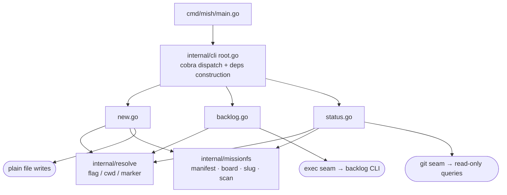
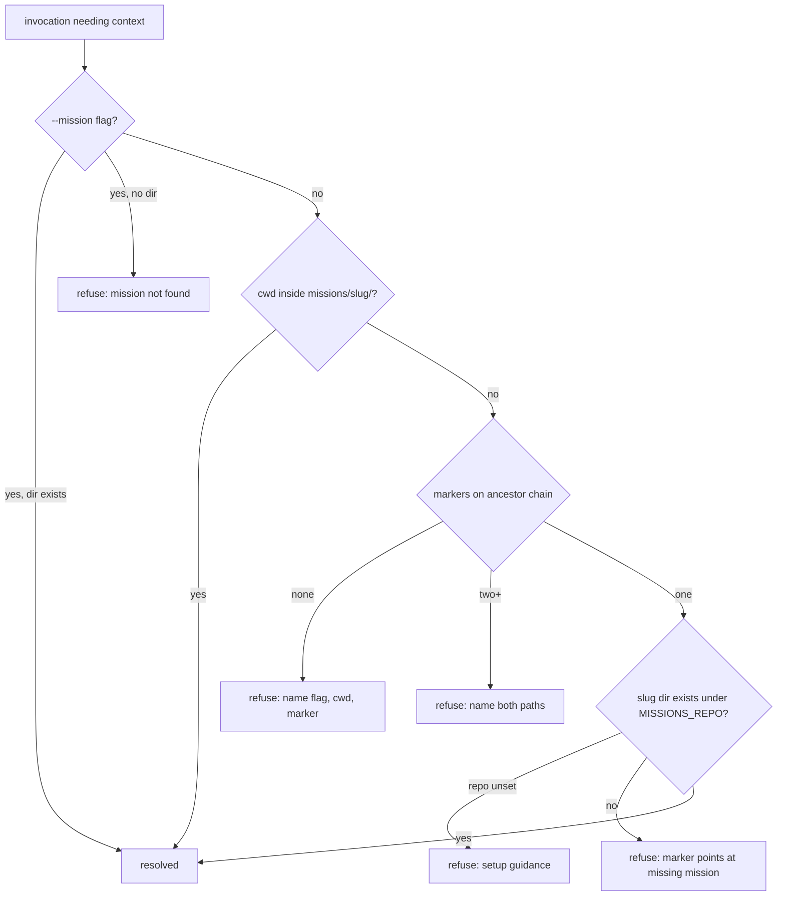
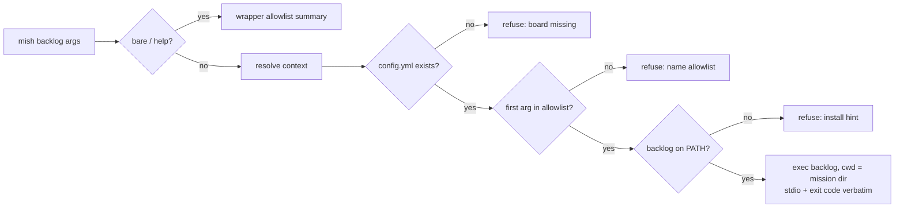

# mish — Mission CLI and Companion Skill - Plan

## Goal Capsule

- **Objective:** implement `mish`, the mission CLI (`new` / `backlog` / `status`), its agent-targeted help surface, and the thin companion skill, exactly as specified by the ratified `docs/specs/mission-spec.md`, with the spec's AC-1..19 encoded as an executable acceptance suite.
- **Authority order:** `docs/specs/mission-spec.md` (RATIFIED, amended §12.9–§12.10) > this plan > implementer judgment. The spec is ratified-not-frozen: a divergence discovered during implementation is surfaced to the owner for a ruling and lands as a §12 entry — never silently absorbed, never re-litigated unilaterally.
- **Execution profile:** greenfield Go module inside ai-config, sesh structural conventions, house help/golden conventions. No production data, no external services; everything is local files plus the Backlog.md CLI.
- **Stop conditions:** stop and surface to the owner if (a) a spec behaviour can't be implemented as written (contradiction, or Backlog.md 1.47.x behaves differently than the spec's verified assumptions), (b) the work seems to need a fourth verb, a new pinned key, or an allowlist change — those are spec amendments, not implementation choices, or (c) sesh's install/ship shape (its U12) lands mid-build and conflicts with this plan's deferral.
- **Tail ownership:** implementer runs the full Verification Contract and reports AC coverage; owner rules on any surfaced divergence.

---

## Product Contract

### Summary

Missions are durable, team-visible working memory: one self-contained directory per mission (`missions/<slug>/{mission.md, backlog/, artifacts/}`) in a shared git repo, herder-unaware, moved and synced by plain git. `mish` is the whole CLI surface: `new` scaffolds, `backlog` is a cwd-pinned allowlisted passthrough to the real Backlog.md CLI, `status` reports read-only. Doctrine with judgment in it (custody commits, closeout, renames, cross-references, marker hygiene) ships as agent-targeted CLI help plus a thin companion skill.

### Problem Frame

Work that outgrows one session has no durable home today — napkin dirs die with branches, run logs are orchestrator-private, artifacts scatter across worktrees. The spec defines the home; this plan builds the tool. The tool's design centre is *shallowness*: scaffold, passthrough, report. Everything requiring judgment is help/skill prose, and the CLI never mutates git.

### Requirements

The spec is normative; these R-IDs are traceability handles into it, not a restatement. Where an R-ID and the spec ever disagree, the spec wins.

**Command surface**

- R1. Exactly three verbs — `new`, `backlog`, `status` — on a binary named `mish` (spec §6, M4, M19). Unknown verbs and flag misuse are usage errors; nothing scans or guesses.
- R2. `mish new` scaffolds the §4.1 tree: the §4.2 manifest (five closed frontmatter keys; authority default OS user, owner via `--owner` → `$SESSION_OWNER` → OS user, both echoed with their source), the pinned board (five §4.4 pins + `project_name`), `artifacts/` with a keep-file, and the `.mission` marker per the §6.1 rules (no-shadow refusal, same-slug no-op, `--no-marker`, skipped inside the missions repo). No git operations; no `AGENTS.md` or other litter beyond the §4.1 tree.
- R3. `mish backlog` resolves context (§5.3), refuses when `backlog/config.yml` is absent (invariant 6 — never ancestor fallthrough), checks the forwarded subcommand against the closed §6.2 allowlist, then execs the Backlog.md CLI with cwd pinned to the mission dir, forwarding arguments, stdio, and exit code verbatim. Bare `mish backlog` prints the wrapper-owned allowlist summary; `mish backlog  --help` passes through to Backlog.md's own help.
- R4. `mish status` renders the §6.3 single-mission block (board counts in the board's configured status order, artifact counts + node-local mtime recency) plus one-line warnings: pinned-key drift, `mission:` ≠ dirname, unknown frontmatter keys, invalid `status:` value, duplicate task IDs, missing board or artifacts, and uncommitted/unpushed subtree changes via a **read-only** git query (silently skipped on non-git repos). Overview mode on `--all` or when contextless inside the missions repo; contextless outside it refuses. No invocation mutates anything (invariant 11).

**Context and config**

- R5. Resolution order is `--mission` flag → cwd-inside-mission-dir → single `.mission` chain marker; markers never shadow (two on one ancestor chain refuse, naming both paths); every failure refuses with the §5.3 guidance; nothing scans for candidates (invariant 12, M11).
- R6. `$MISSIONS_REPO` locates the repo and carries no mission identity; commands needing it while unset refuse with setup guidance (§5.1).
- R7. The five pinned config keys are invariant for the mission's life; `init`, `config`, `agents`, and `browser` stay outside the allowlist with their recorded reasons (invariant 7, M3, M5).

**Doctrine delivery**

- R8. Agent-targeted help is the primary doctrine surface (M17): top-level help carries the concept model; per-verb help carries the working prose — custody-commit grammar (§8.2), closeout checklist (§8.4), rename procedure (§8.5), marker hygiene (§8.6), git rhythm (§8.1), and the cross-reference vocabulary with its replace-not-append edge (§8.3).
- R9. The companion skill is a thin, mission-owned stub pointing at the CLI help, carrying only doctrine that spans git and multi-writer judgment; general mission doctrine never moves into the orchestrate skill (M17).
- R10. Cross-references ride Backlog.md's native per-task `references` field through the existing passthrough (`--ref`); the CLI adds no machinery — help/skill document the open label-grade vocabulary and the verified replace-on-edit sharp edge (M18, §12.9).

**Quality**

- R11. Spec AC-1..19 are encoded as an executable acceptance suite; AC-5..7 + AC-19 are re-runnable standalone as the Backlog.md version-change gate (M2, M16).
- R12. Herder-unawareness holds end to end: no herder/hcom concept in code, files, or help; the full surface works on a machine with no herder, no bus, and a non-git `$MISSIONS_REPO` (degraded to single-node, no staleness line) (invariant 2, AC-14).

### Acceptance Examples

Spec §9 (AC-1..19) is the normative acceptance suite and is not duplicated here. Unit-to-AC coverage is mapped in each implementation unit and in the Verification Contract.

### Scope Boundaries

**Deferred to Follow-Up Work**

- Install/ship packaging (versioning, release, PATH install). sesh's install unit (its U12) is in flight and defines the house shape; mish copies it once landed — sync with the sesh orchestrator before pinning. Until then `mish` runs from source (`go build`), which the README documents.
- `--commit` per-invocation auto-commit: designed in spec §6.4, ratified as **reserved, out of v1**. Do not implement; the closeout custody-rhythm review (§8.4) is the evidence stream for whether it's ever needed.
- A `bin/mish` self-building launcher (the bottle/herder pattern): decide when the install shape lands; sesh ships without one today.

**Outside the product's identity** (spec §10 — recorded decisions, not omissions)

- No event log, no `log`/`adopt`/`harvest`/`archive`/`list` verbs, no viewer, no realtime interface, no search/indexing, no orchestrate file conventions, no auth model, no merge drivers.

### Product Contract preservation

Changed before planning, by owner ruling (not by this plan): spec amended post-ratification with §12.9 (cross-references on the native `references` field, M18, AC-19) and §12.10 (CLI named `mish`, M19), committed as `a475b06`. The Product Contract above is otherwise carried from the spec by reference, unmodified.

---

## Planning Contract

### Key Technical Decisions

- KTD1. **Home and module:** `tools/mish/` in ai-config as a **standalone Go module** (`module mish`, go 1.26.x via the mise-pinned toolchain, `GOTOOLCHAIN=local`), zero imports from the rest of the repo — the sesh precedent, owner-confirmed. Import isolation keeps later extraction to its own repo cheap. Third-party deps are unrestricted (sesh uses cobra et al.); prefer few.
- KTD2. **Dispatch:** cobra, one file per subcommand in `internal/cli` (`root.go`, `new.go`, `backlog.go`, `status.go`), with a `root_test.go` pinning the command surface (sesh convention). Load-bearing detail: the `backlog` command must set `DisableFlagParsing` (or equivalent) so the passthrough tail is forwarded verbatim — only a leading `-h`/`--help`/`help` (wrapper help) and the `--mission` flag are interpreted by the wrapper, and `--mission` is only recognized *before* the first backlog subcommand token, never plucked from the tail.
- KTD3. **Help as contract:** doctrine lives in the help strings; goldens under `internal/cli/testdata/golden/` pin root help and every `<verb> --help` byte-exact, regenerated with an `-update` flag, plus a root line-budget test — the bottle/herder house convention, adopted because M17 makes help the product surface (sesh itself has no help-golden convention; its goldens are HTML render goldens). Greenfield translation of the "never write the golden from the implementation side" rule: write help text and goldens *from the spec*, then make code match.
- KTD4. **Seams:** a small deps struct injected into command funcs — env lookup, cwd, exec runner (for the `backlog` binary), git query runner, clock, stdout/stderr (bottle precedent). Unit tests exercise commands with fake seams; scenario harnesses exercise the real thing. `$MISSIONS_REPO` is resolved once at deps construction, never read inline.
- KTD5. **Scaffold writes the board directly** rather than shelling to `backlog init`: init prompts interactively on non-git dirs (verified this session), requires answering git questions, and writes `AGENTS.md` litter the spec bars (§6.1). The board template (config.yml shape + directory set) is *cut from a real `backlog init` run* and stored as a fixture (sesh hygiene: never synthesize fixtures); AC-4 proves the contract ("task create works immediately after") against the real backlog binary.
- KTD6. **`status` reads the board by parsing task-file frontmatter directly** (id + status) with the status order taken from the board's `config.yml` — no backlog subprocess. This makes invariant 11 trivially auditable, works when `backlog` is missing from PATH, and duplicate-ID detection falls out of the same parse.
- KTD7. **Staleness query** goes through the git seam as read-only subcommands scoped to `missions/<slug>` (uncommitted via porcelain status; unpushed via upstream range). Exact command choice is implementation; the contract is: read-only, silently skipped when the repo isn't git or has no upstream, and never anything but `status`'s one warning line.
- KTD8. **Manifest/config parsing** uses a standard YAML library for reads (manifest frontmatter, config.yml pins/statuses); the scaffold *writes* config.yml from the KTD5 fixture-derived template rather than re-marshalling, keeping the byte shape close to Backlog's own output.
- KTD9. **Error and exit grammar:** exit 0 success, 1 refusal/operational failure, 2 usage; stderr messages `mish <verb>: <message> — <remedy>`; every §5.3 refusal names the fix; allowlist refusals name the allowlist. The passthrough forwards Backlog.md's own exit code verbatim on allowed subcommands.
- KTD10. **Skill delivery:** `skills/mish/SKILL.md`, bottling-shaped thin stub (frontmatter `name` + trigger-rich `description`; body points at `mish` help as the real surface). Dropping the directory is the whole install — `ai-setup` symlinks it into agent skill roots.
- KTD11. **Backlog.md dependency:** pin `npm:backlog.md` in `mise.toml` to a 1.47.x version (currently `latest`), satisfying the spec's ≥ 1.47 floor deterministically; the passthrough refuses with a clear install hint when `backlog` is absent from PATH (LookPath guard). No version *enforcement* in the CLI — the AC-5..7 + AC-19 suite owns floor verification.

### High-Level Technical Design

Package map — three verbs over two shared internal packages, all external effects behind seams:

Context resolution (§5.3) — first hit wins, every failure refuses:

Passthrough guard sequence (§6.2) — nothing executes until every gate passes:

Diagrams are authoritative alongside the prose; where they and spec text disagree, the spec wins.

### Sequencing

U1 → U2/U3 (parallel) → U4/U5/U6/U7 (parallel once their deps land) → U8 and U10 (parallel — U10 needs only the verbs, so the risk-surfacing acceptance harness starts as early as its dependencies allow) → U9 (after U8) and U11 (after U8 + U10). Help goldens (U8) intentionally come after the verbs land so per-verb `--help` output exists to pin — but the help *text* is drafted from the spec, not from the implementation (KTD3).

### Risks & Dependencies

- **Backlog.md behavioural drift.** All load-bearing assumptions (nearest-ancestor resolution, pin semantics, `references` semantics, init litter) are verified on 1.47.1 only. Mitigation: KTD11 mise pin + the standalone version-change gate (AC-5..7 + AC-19).
- **cobra flag-parsing on the passthrough tail.** If the wrapper ever parses the tail, flags like `--ref` values or `-s "In Progress"` get eaten. Mitigation: KTD2's `DisableFlagParsing`; AC-11 harness asserts verbatim forwarding including flag-shaped arguments.
- **Board template staleness.** KTD5's fixture-derived template can drift from what newer Backlog versions expect. Mitigation: AC-4 runs against the real binary in every suite run; the version-change gate re-cuts fixtures when the pin moves.
- **sesh conventions read secondhand.** `tools/sesh` lives on the `sesh-build` branch, not this one; conventions come from the sesh orchestrator's brief. Mitigation: eyeball `tools/sesh` from a `sesh-build` checkout at implementation start; structural mismatches are cheap to fix at U1.
- **Repo tooling gap.** `tools/` is outside `bin/ai-push`'s PUSH_PATHS allowlist; mish commits ride plain git like herder/bottle. Not a blocker — just don't rely on ai-push.

---

## Implementation Units

| U-ID | Title | Key paths | Depends on |
|---|---|---|---|
| U1 | Module bootstrap + CLI skeleton | tools/mish/{go.mod,cmd,internal/cli} | — |
| U2 | Context resolution package | tools/mish/internal/resolve | U1 |
| U3 | Mission format package | tools/mish/internal/missionfs | U1 |
| U4 | `mish new` | tools/mish/internal/cli/new.go | U2, U3 |
| U5 | `mish backlog` passthrough | tools/mish/internal/cli/backlog.go | U2, U3 |
| U6 | `mish status` single-mission | tools/mish/internal/cli/status.go | U2, U3 |
| U7 | `mish status` overview + refusals | tools/mish/internal/cli/status.go | U6 |
| U8 | Agent-targeted help + goldens | tools/mish/internal/cli/testdata/golden | U4–U7 |
| U9 | Companion skill | skills/mish/SKILL.md | U8 |
| U10 | Scenario harness suite (AC-1..19) | tools/mish/tests | U4–U7 |
| U11 | Repo integration + docs | tools/mish/README.md, mise.toml | U8, U10 |

### U1. Module bootstrap and CLI skeleton

- **Goal:** a building, testable, cross-compiling `mish` with the three verbs registered and nothing else.
- **Requirements:** R1.
- **Dependencies:** none.
- **Files:** `tools/mish/go.mod`, `tools/mish/cmd/mish/main.go`, `tools/mish/internal/cli/root.go`, `tools/mish/internal/cli/deps.go`, `tools/mish/internal/cli/root_test.go`.
- **Approach:** standalone module per KTD1; thin main delegating to `cli.Run(args, stdout, stderr) int`; cobra root with `new`/`backlog`/`status` registered as stubs; deps struct (KTD4) constructed in one place. Match sesh's file-per-subcommand shape; eyeball `tools/sesh` on the `sesh-build` branch before locking the skeleton.
- **Test scenarios:** root_test pins the surface — exactly three subcommands; unknown subcommand exits 2 with a message naming `mish` for the command list; bare `mish` and `mish --help` exit 0.
- **Verification:** `go test ./... && go vet ./...` green; darwin/arm64 and linux/amd64 builds succeed.

### U2. Context resolution package

- **Goal:** §5 resolution as a pure, heavily tested package: flag → cwd-in-mission-dir → single chain marker, refuse-never-guess.
- **Requirements:** R5, R6.
- **Dependencies:** U1.
- **Files:** `tools/mish/internal/resolve/resolve.go`, `tools/mish/internal/resolve/resolve_test.go`.
- **Approach:** input is (flag value, cwd, env lookup, filesystem); output is a resolved mission path or a typed refusal matching the §5.3 error set. Marker walk collects *all* `.mission` files on the ancestor chain before deciding, so the two-marker refusal can name both paths. Cwd-inside-mission-dir detection requires `mission.md` with a parent chain under `missions/`.
- **Test scenarios:** all of AC-9 at unit level (flag beats cwd beats marker; two markers refuse naming both; flag naming missing dir refuses); all of AC-10 (no context → guidance naming all three mechanisms; marker → missing mission names the slug; unset `$MISSIONS_REPO` → setup guidance); marker file with trailing content beyond line 1 resolves on line 1; cwd inside `missions/<slug>/backlog/tasks/` resolves to `<slug>`; a `mission.md` outside a `missions/` parent chain does not resolve.
- **Verification:** unit tests cover every branch of the §5.3 flowchart; no filesystem scan beyond the ancestor walks.

### U3. Mission format package

- **Goal:** one package owning the mission-dir format: manifest read/write, slug validation, board config read (pins + statuses), task scan (status counts, duplicate IDs), artifacts scan (count, newest mtime).
- **Requirements:** R2, R4, R7 (read side).
- **Dependencies:** U1.
- **Files:** `tools/mish/internal/missionfs/manifest.go`, `slug.go`, `board.go`, `scan.go`, matching `_test.go` files, `tools/mish/internal/missionfs/testdata/` (fixtures cut from real `backlog init` output and real task files).
- **Approach:** YAML lib for reads per KTD8; manifest writer emits the §4.2 skeleton exactly; slug regex `^[a-z0-9][a-z0-9-]{0,63}$` plus the no-trailing/no-consecutive-hyphen refinements; board reader surfaces pin drift as typed findings for `status`; task scan parses only frontmatter `id:`/`status:`, and the scan set is `backlog/tasks/` **plus `backlog/completed/`** — the allowlisted `cleanup` verb ages Done tasks there, and closed boards must still count them (the spec's overview illustration shows a closed mission at 0/0/21) — while `drafts/`, `docs/`, and `decisions/` are excluded from counts and duplicate-ID detection.
- **Test scenarios:** AC-2's slug table (`Perf_Regression`, `-x`, `a--b`, `x-`, 65 chars — each refused with a one-line reason); manifest round-trip preserves the five keys; unknown frontmatter key detected; `mission:` ≠ dirname detected; each of the five pins individually drifted → detected; duplicate task IDs across two task files detected; a task aged into `completed/` still counts as Done and a draft is not counted; status counts follow config.yml's configured status order, not a hardcoded vocabulary; artifacts scan on a missing dir reports missing rather than erroring.
- **Verification:** fixtures are real-cut, never hand-written; unit tests green.

### U4. `mish new`

- **Goal:** the §6.1 scaffold, end to end.
- **Requirements:** R2, R5, R6.
- **Dependencies:** U2, U3.
- **Files:** `tools/mish/internal/cli/new.go`, `new_test.go`, board template fixture under `tools/mish/internal/missionfs/testdata/`.
- **Approach:** validate slug → refuse on existing dir → write manifest (authority default OS user, never `$SESSION_OWNER`; owner chain `--owner` → `$SESSION_OWNER` → OS user) → write board from the KTD5 template with the five pins + `project_name: <slug>` → `artifacts/` + keep-file → marker per rules (chain-walk first: different-slug marker anywhere on chain refuses; same-slug → no-op; `--no-marker` or cwd inside missions repo → skip). Echo stamped authority and owner each with its source (flag / env / OS user). No exec of `backlog init`; no git.
- **Test scenarios:** AC-1 (full tree, five frontmatter keys, five pins, marker content, echo lines with sources — with and without `$SESSION_OWNER` set); AC-2 refusals; AC-3 marker matrix (different-slug marker refuses; same-slug no-op; `--no-marker`; invoked from inside missions repo writes none); `--title` default is the slug with hyphens spaced; keep-file exists under `artifacts/`; scaffold contains nothing beyond the §4.1 tree (directory listing compared exactly — the AGENTS.md litter test); refusal when `$MISSIONS_REPO` unset.
- **Verification:** unit tests with temp dirs + fake env; AC-4 (board immediately usable) is proven in U10 against the real binary.

### U5. `mish backlog` passthrough

- **Goal:** the §6.2 pinned passthrough: guard chain, allowlist, verbatim exec.
- **Requirements:** R3, R7, R10 (transport for `--ref`).
- **Dependencies:** U2, U3.
- **Files:** `tools/mish/internal/cli/backlog.go`, `backlog_test.go`, `allowlist.go`.
- **Approach:** KTD2's flag-parsing discipline; guard order exactly as §6.2 (resolve → board-exists → allowlist → LookPath → exec with cwd = mission dir); allowlist as a declared table (`task`/`tasks`, `draft`, `board`, `search`, `overview`, `sequence`, `doc`, `decision`, `milestone`/`milestones`, `cleanup`) with exclusion reasons in comments mirroring the spec; refusals per KTD9. Wrapper help on bare/`help`/leading `-h|--help`; anything after an allowed subcommand — including `--help` — forwards untouched.
- **Test scenarios:** AC-11 at unit level (denied: `init`, `config`, `agents`, `browser`, an unknown future subcommand — each names the allowlist; allowed subcommands exec with args verbatim, asserted via a fake exec seam capturing argv/cwd); AC-6 (missing `config.yml` refuses with board-missing error; fake seam proves backlog was never invoked); exit code from the seam is returned verbatim (0, 1, 7); flag-shaped tail args (`--ref x@y`, `-s "In Progress"`) arrive at the seam unmodified; `--mission` before the subcommand resolves, `--mission` after the subcommand token forwards to backlog; missing binary → install-hint refusal.
- **Verification:** unit tests via fake seam; real-binary behaviour in U10.

### U6. `mish status` single-mission

- **Goal:** the §6.3 report block and its full warning set, read-only.
- **Requirements:** R4, R12.
- **Dependencies:** U2, U3.
- **Files:** `tools/mish/internal/cli/status.go`, `status_test.go`.
- **Approach:** compose from missionfs findings (KTD6) + git seam staleness (KTD7). Warnings are each one line; recency from mtimes only. `--mission` naming a missing dir refuses before any partial render.
- **Test scenarios:** AC-12 at unit level — happy block matches the §6.3 shape; each warning fires from its induced condition (drifted pin, dirname mismatch, unknown key, invalid `status:` value, duplicate IDs, missing board, missing artifacts); staleness line appears with a fake git seam reporting dirty/unpushed and is absent when the seam reports non-git; before/after subtree hash identical (read-only proof); board counts render in configured status order for a board with custom statuses.
- **Verification:** unit tests; the no-mutation and real-git staleness proofs re-run in U10.

### U7. `mish status` overview and refusals

- **Goal:** §6.3 overview mode: one line per mission dir, closed missions included; refusal outside the repo.
- **Requirements:** R4, R5.
- **Dependencies:** U6.
- **Files:** `tools/mish/internal/cli/status.go`, `status_test.go` (extended).
- **Approach:** trigger on `--all`, or contextless while cwd is inside `$MISSIONS_REPO`; cheap filesystem scan of `missions/*/`; TASKS column in each board's own status order; UPDATED is node-local recency. Contextless outside the repo → §5.3 refusal.
- **Test scenarios:** AC-13 at unit level (overview from repo root with no marker lists active + closed; unrelated cwd refuses); `--all` from anywhere with `$MISSIONS_REPO` set works; a mission dir with a broken manifest gets a row with a warning marker rather than aborting the whole table.
- **Verification:** unit tests green.

### U8. Agent-targeted help surface and goldens

- **Goal:** the M17 doctrine surface: top-level concept help, per-verb working prose, golden-pinned.
- **Requirements:** R8, R10.
- **Dependencies:** U4–U7.
- **Files:** `tools/mish/internal/cli/help.go` (or per-command Long strings), `help_golden_test.go`, `tools/mish/internal/cli/testdata/golden/*.txt`.
- **Approach:** draft every help body *from the spec* (KTD3): root = concept model (mission, slug, marker, authority/owner, custody) + verb table; `new` help = §6.1 semantics + owner/authority chains; `backlog` help = allowlist table with one-liners + exclusion rationale + references vocabulary and replace-edge (§8.3); `status` help = warning meanings + staleness semantics; plus doctrine paragraphs herder-style: git rhythm (§8.1), custody grammar with verbs and trailers (§8.2), closeout checklist (§8.4), rename procedure (§8.5), marker hygiene (§8.6). Golden tests pin all of it byte-exact; root help gets a line budget.
- **Test scenarios:** golden match for root and each verb; line-budget test on root help; a drift test asserting the help verb table matches the registered command set; grep-level assertions that the `backlog` help names every allowlisted subcommand and none of the excluded ones as available.
- **Verification:** goldens regenerated only via the `-update` flag; review reads the goldens against spec §6.2/§8 before commit.
- **Execution note:** write the help text and goldens from the spec first, then make output match — never generate goldens from whatever the code happens to print.

### U9. Companion skill

- **Goal:** `skills/mish/` — the thin, mission-owned companion (M17).
- **Requirements:** R9.
- **Dependencies:** U8.
- **Files:** `skills/mish/SKILL.md`, `skills/mish/references/multi-writer-walkthrough.md`.
- **Approach:** bottling-shaped stub (KTD10): frontmatter `name: mish` + trigger-rich description (missions, mission board, custody, harvest, closeout, `$MISSIONS_REPO`…); body says the CLI help is the real surface (`mish`, `mish <verb> --help`), then carries only what spans git: when to mint a mission, custody-commit worked examples (AC-17's grammar for new/adopt/harvest/rename/close), the §7.2 conflict taxonomy with the AC-16 and AC-18 walkthroughs as a references doc, disjoint-artifact-path convention, pull-before-create rhythm. Nothing herder- or orchestrate-specific.
- **Test scenarios:** none — prose artifact. Test expectation: none — validated by review against spec §8 and by AC-16/17/18 being fully worked in the walkthrough doc.
- **Verification:** worked custody examples parse against the §8.2 grammar (`mission(<slug>): <verb> 
`); skill contains no CLI mechanics that belong in help.

### U10. Scenario harness suite (AC-1..19)

- **Goal:** the spec's acceptance scenarios as executable, hermetic shell checks against the real `backlog` binary — the milestone gate.
- **Requirements:** R11, R12.
- **Dependencies:** U4–U7.
- **Files:** `tools/mish/tests/lib.sh`, `tools/mish/tests/check-scaffold.sh` (AC-1..4), `check-nesting.sh` (AC-5..8), `check-resolution.sh` (AC-9..10), `check-surface.sh` (AC-11..13), `check-isolation.sh` (AC-14), `check-multiwriter.sh` (AC-15), `check-references.sh` (AC-19), `check-backlog-floor.sh` (re-runs AC-5..7 + AC-19 standalone — the version-change gate), `tools/mish/tests/fixtures/` + `fixtures/README.md`.
- **Approach:** sesh harness shape (lib.sh + check scripts printing ALL GREEN); each check builds temp missions repos (git-backed for AC-5/7/12/15, plain dir for AC-14) and drives the built `mish` binary. AC-14's no-mutation audit: prepend a PATH shim `git` wrapper that logs every invocation; assert zero invocations on the non-git run and only read-only subcommands on the git-backed run. AC-15 uses two clones of a temp origin and a real merge. AC-16/18 are doctrine scenarios — validated as U9's walkthrough, not scripted here (the spec says so).
- **Test scenarios:** the ACs themselves, one-to-one; plus lib-level guards — every check runs under `env -i`-style minimal env with explicit `$MISSIONS_REPO`/`$SESSION_OWNER` control; fixtures documented as real-cut in `fixtures/README.md`.
- **Verification:** `for f in tools/mish/tests/check-*.sh; do bash "$f"; done` prints ALL GREEN on a real machine (not CI-cached), with mise's pinned backlog on PATH.

### U11. Repo integration and docs

- **Goal:** the surrounding repo knows about mish: README with gates, pinned Backlog.md, dependency notes.
- **Requirements:** R11 (gates documented), R7/KTD11 (floor pinned).
- **Dependencies:** U8, U10.
- **Files:** `tools/mish/README.md`, `mise.toml`.
- **Approach:** README mirrors bottle/herder shape — what mish is (one paragraph, pointing at the spec), dev invocation (`go build ./...` from `tools/mish`), a Gates section listing the exact Verification Contract commands, golden-regen flow, and the version-change re-verification rule. `mise.toml`: pin `"npm:backlog.md"` from `latest` to the verified 1.47.x.
- **Test scenarios:** none — docs/config. Test expectation: none — README gates are validated by running them verbatim; the mise pin is validated by `backlog --version` in the harness lib.
- **Verification:** a cold read of the README suffices to run every gate; `mise install` yields the pinned backlog version.

---

## Verification Contract

Run from `tools/mish/` with the mise go toolchain active (`GOTOOLCHAIN=local`):

| Gate | Command | Proves |
|---|---|---|
| Unit + vet | `go test ./... && go vet ./...` | All unit scenarios incl. resolution matrix, slug table, allowlist, warning set |
| Cross-build | `GOOS=darwin GOARCH=arm64 go build ./...` and `GOOS=linux GOARCH=amd64 go build ./...` | sesh's always-on portability gate |
| Help goldens | `go test ./internal/cli -run Golden` (regen: `-update`) | Help surface = spec §6.2/§8, drift-pinned |
| Acceptance | `for f in tests/check-*.sh; do bash "$f"; done` → ALL GREEN | Spec AC-1..15, AC-19 against the real backlog binary |
| Version-change gate | `bash tests/check-backlog-floor.sh` | AC-5..7 + AC-19 standalone; re-run whenever the Backlog.md pin moves |
| Doctrine review | read `skills/mish/` + help goldens against spec §8 | AC-16..18 (doctrine scenarios, prose-validated by design) |

## Definition of Done

- All eleven units landed; every gate above green on a real machine.
- Every spec AC accounted for: AC-1..15 and AC-19 executable and passing; AC-16..18 fully worked in the skill walkthrough.
- Help goldens pinned with the line-budget and registry-drift tests in place; help text traced from the spec, not reverse-engineered from code.
- `mise.toml` pins Backlog.md at the verified 1.47.x; harness asserts the version floor.
- `skills/mish/` present and picked up by `ai-setup` symlinking (verified by running `ai-setup` once).
- Zero spec divergences silently absorbed: anything that didn't implement as written has an owner ruling recorded in spec §12.
- No abandoned or experimental code in the final diff; `tools/mish` imports nothing from the rest of ai-config (checked via `go mod why`/import review).

## Sources & Research

- `docs/specs/mission-spec.md` — normative, RATIFIED 2026-07-09, amended §12.9–§12.10 (`a475b06`).
- sesh conventions: sesh orchestrator brief (2026-07-09) — standalone module, cobra, file-per-subcommand, scenario harnesses, cross-build gates, real-cut fixtures; `tools/sesh` on branch `sesh-build` is the code precedent.
- House CLI patterns: `tools/bottle/internal/cli` (deps seams, help goldens, line budget, exit grammar), `tools/herder/tests/check-*.sh` (hermetic PATH-shim harnesses), `docs/plans/2026-07-02-003-feat-herder-go-port-plan.md` (goldens-from-spec rule).
- Live verifications this session (Backlog.md 1.47.1): `references` field semantics (create/edit `--ref`, survival across edits, replace-on-edit, `--plain` rendering); `backlog init` interactive prompting on non-git dirs.
- `napkins/mission-spec/predecessor-findings.md` — nested-board verification (2026-07-08) the spec encodes.
