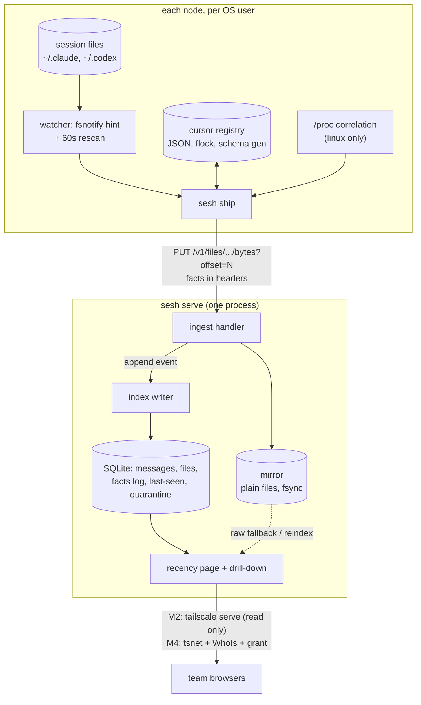
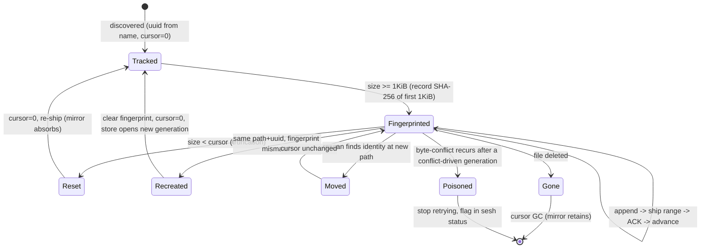
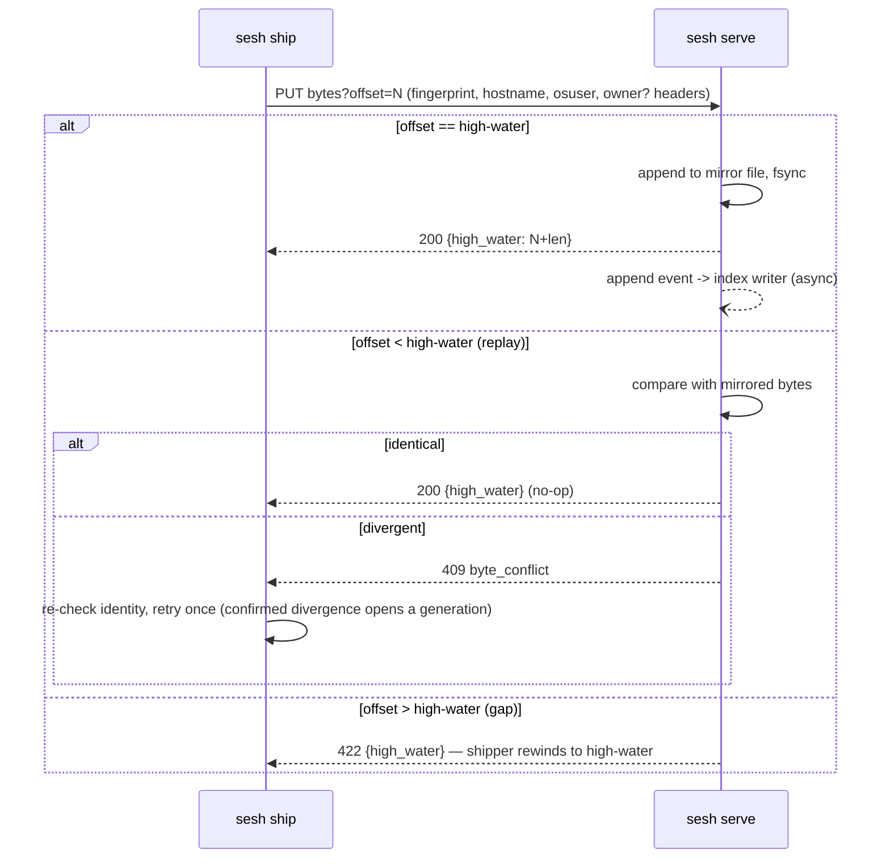

# sesh Session Service - Plan

## Goal Capsule

- **Objective:** Build `sesh` — per-user shippers that mirror Claude Code and Codex CLI session transcripts byte-faithfully to one central store with a parse-on-ingest index and one team recency page — to the eleven acceptance scenarios in `docs/specs/session-service-spec.md` §6.
- **Authority hierarchy:** the spec (invariants I1–I11) > the M0 wire-freeze doc once merged > this plan > implementer judgment. The settled decisions in `docs/design/2026-07-09-sesh-task-captures.md` are DO-NOT-REVERSE; deviation from any invariant is a stop condition, not a judgment call.
- **Execution profile:** four board tasks (TASK-085 shipper, TASK-086 store, TASK-087 surface, TASK-088 deploy) executed by a dedicated orchestrator; units below are grouped into milestones M0–M4 and mapped to their owning task. M0 blocks parallelism; M2 is the first useful ship; M4 is done-per-spec.
- **Stop conditions:** any change to the wire contract after the M0 freeze merges; any invariant deviation; any scope growth beyond the spec's §9 non-goals. Escalate to the board steward (@hera), who routes design questions to the design authority (tomo).
- **Tail ownership:** each milestone's gate scenarios must pass on a real machine before the milestone is declared done; the orchestrator owns declaring milestones, the owner ratifies M2 exposure and M4 done-per-spec.

---

## Product Contract

### Summary

`sesh` answers "what has everyone been working on?" for a team running AI coding agents across many machines. A per-OS-user shipper tails the JSONL transcript files the harnesses already write, ships raw byte ranges plus identity facts over an idempotent HTTP API to a central store, which keeps a byte-faithful mirror (the durable archive — it outlives the clients' ~30-day cleanup), parses centrally into a message index, and serves one read-only recency page. Product shape, invariants, and acceptance scenarios are ratified in `docs/specs/session-service-spec.md`; this plan carries the implementation contract.

### Problem Frame

Session transcripts are trapped per-machine, per-user, and expire in ~30 days. Nothing existing does the job (see `docs/design/2026-07-09-session-shipping-prior-art.md`: closest analogs are single-user file sync and parsed-event relays). The transcript formats are upstream-internal and version-unstable, and "append-only" has verified exceptions (resume creates new files with duplicated history, `/cd` relocates files, concurrent resumes interleave), so the settled architecture keeps nodes dumb (bytes + facts out) and concentrates all format knowledge in one central parser.

### Requirements

Requirements restate the spec at implementation grain; spec references in parentheses are the trace.

**Shipping**

- R1. The shipper discovers and tails all Claude/Codex session files for its OS user, file-driven: dead, pre-install, and live files ship through the same path, backfill from offset 0 included (I3; S1).
- R2. File identity is session UUID + content fingerprint — never path or inode; cursors survive renames/moves, size regression resets to 0 and re-ships, deletion GCs the cursor without resetting anything (I6; S3, S4, S5).
- R3. Every ship carries hostname and OS user; `SESSION_OWNER` is attached when the Linux `/proc` correlation yields it — codex via open rollout fd (exact), claude via (node, OS user, cwd) cohort unanimity, macOS never; observed correlations are recorded and never retracted (I1, I8; S6, S7, S11).
- R4. When the store is unreachable the shipper holds position; the source file is the only buffer (no local queue).
- R5. One shipper per OS user; it never reads another user's `/proc/<pid>/environ` (I9; S7).

**Store**

- R6. Ingest is idempotent byte-range PUT with a durable-ACK high-water response; identical replays overwrite-compare silently (I4; S9).
- R7. Divergent bytes at an already-ACKed offset are a conflict: the store never overwrites mirrored bytes and returns a distinct conflict error; the shipper re-checks its local identity and retries once, and a confirmed second divergence opens a new generation of the file identity; conflict recurrence after a conflict-driven generation marks the file poisoned (visible in `sesh status`) and the shipper stops retrying it.
- R8. The mirror is byte-faithful and retained past client deletion (I2, I7; S5).
- R9. The index is parse-on-ingest: the logical session id is derived from parsed line content (the wire session id is a filename claim, used as fallback); dedup key is (logical session, entry type, message uuid); trailing partial lines are held back (I5; S2).
- R10. Parse failures quarantine index entries without blocking the mirror; `sesh reindex` re-derives the full index from the mirror; quarantine counts (total and recent) are exposed to operators (S10).
- R11. The store records last-PUT time per (node identity, hostname, OS user) so a silently dead shipper is visible before the 30-day client cleanup destroys its buffer.
- R12. ACK means mirror bytes are fsynced; index writes are post-ACK and best-effort — an index write failure marks the file dirty-for-reindex (distinct from parse quarantine); any mirror storage error returns 5xx and never ACKs.
- R13. `{tool}` is a closed enum (`claude`, `codex`); the store rejects unknown tools; adding a tool is a wire-doc amendment.

**Surface**

- R14. One read-only page: person → nodes → sessions, ordered by recency = max parsed message timestamp (first-ingest time for fully quarantined sessions), with "mirrored at" as a secondary field (S1–S2 rendering).
- R15. Display owner is computed at view time — SESSION_OWNER > tailnet identity > OS user > hostname — with the winning fact's source labeled; conflicting owner facts for one session render as honest absence with a "conflicting claims" label; facts are stored as an append-only observation log, never latest-wins (I1, I10).
- R16. Transcript drill-down renders from the index ordered by (parsed timestamp, file, in-file ordinal) — never by parentUuid chains; a raw-JSONL fallback from the mirror renders whenever the index cannot (S2, S10).
- R17. No search, no write actions on the page.

**Auth and exposure**

- R18. From M4: identity on every connection via the tailnet (WhoIs), stamped by the store and never trusted from request content; access scoped by a tailnet grant, ship-deny and read-deny verified before any transcript leaves the box (S8).
- R19. Before M4: ingest binds loopback only, unconditionally; team read access at M2 goes through `tailscale serve` on the store host — an owner-approved interim whole-tailnet-readable exposure, recorded as such.
- R20. Redaction ruling: v1 keeps no automatic redaction (accepted risk, owner-approved); `sesh admin drop-file <identity>` deletes one file's mirror bytes and index rows as the operator-only remove path.

**Packaging and operations**

- R21. One binary, `sesh`, subcommands `ship`, `serve`, `reindex`, `status`, `admin drop-file`; a conventional, self-contained Go module at `tools/sesh` with no imports from elsewhere in the repo — movable to its own repo by `git mv`.
- R22. `sesh ship` runs under a per-user systemd unit (Linux) and launchd agent (macOS) that exec a pinned binary path and survive reboot; the only node config is the store URL (env var or flag).
- R23. The cursor registry is a single per-user state file under `${SESH_STATE_DIR:-$XDG_STATE_HOME/sesh}`, written atomically (temp + fsync + rename) under an exclusive flock, carrying a schema generation; a writer older than the file's generation refuses with a typed error naming cause and remedy — an unreadable registry is treated as lost and rebuilt from rescan + recovery GETs.
- R24. The wire API (`/v1` HTTP PUT byte ranges + recovery GET) is the only contract between shipper and store; M0 freezes its exact headers, error semantics, fingerprint algorithm, and index schema in `docs/specs/sesh-wire.md` before lanes parallelize.
- R25. Ingest publishes an internal append event (file identity, byte range, new index rows) consumed by the index writer — the enabling hook for a later SSE live-stream surface.

### Scope Boundaries

**Non-goals (spec §9, binding):** no search; no node-side parsing or policy; no process supervision; no live-relay guarantees; no per-session ACLs in v1; no OTel transport; no hcom/herder/mission awareness; no Windows.

**Deferred to Follow-Up Work:**

- SSE endpoint (`GET /v1/sessions/{id}/stream`) for live session tailing — v2 surface; R25 keeps it a subscription, not a re-plumb.
- Retention policy machinery (v1 keeps everything; a policy needs product thought).
- Grouping surface rows by tailnet node identity instead of hostname (hostname instability accepted in v1).
- Per-session ACLs, tsidp/OIDC upgrade path.
- Upstream ask: Claude Code exposing session id in process env (deletes the cwd-ambiguity class in R3).

---

## Planning Contract

### Key Technical Decisions

**Language, module, packaging**

- **Standalone conventional Go module** (`module` name independent of the repo path; `cmd/sesh` + `internal/`), cobra for the subcommand tree, `log/slog`, Go ≥1.26. Owner ruling supersedes the house self-building-launcher convention: no `bin/sesh` bash wrapper, no shims — plain `go build`, cross-compiled linux/darwin. Rationale: this tool will move repos; the repo is treated as a monorepo hosting it.
- **Dependencies are unrestricted** (owner ruling): `fsnotify`, `modernc.org/sqlite` (pure-Go — keeps darwin/linux cross-compiles toolchain-free), `spf13/cobra`, `golang.org/x/sync/errgroup`, `tailscale.com/tsnet` (M4 only), htmx as one embedded static asset. Pinned by go.sum; no vendoring.

**Storage**

- **Mirror = plain files on disk**, one per (tool, session id, file uuid, generation), append-only, fsynced before ACK. Rationale: byte-faithfulness is the product; a database adds nothing to "store these bytes."
- **Index and store bookkeeping = SQLite** (message rows, file registry, high-water marks, fact observation log, node last-seen, quarantine ledger). Single-process single-writer; WAL mode.
- **Cursor registry = one JSON file per user**, atomic replace under flock, `schema_generation` field with refuse-older-writer (R23). Rationale: the herder registry incidents (poison-row write freeze, dormant-brick migration) fixed this bug class with exactly this discipline; a second database on every node buys nothing for a few hundred cursors.

**Correctness machinery (from the flow analysis; route exact wire text into M0)**

- **Conflict → generation, never overwrite** (R7): divergence at an ACKed offset is the one case where "idempotent" and "byte-faithful" collide; generations preserve both histories and break the infinite-retry pathology.
- **Logical session id from parsed content** (R9): the wire id is a filename claim, and Claude's verified resume behavior writes one session's history into a new file uuid — keying dedup by the wire id passes every scenario except S2, the one dedup exists for.
- **Recency = parsed message timestamps** (R14): ingest-time recency would let every late-onboarded node's 30-day backfill flood the page top exactly when the team first looks.
- **Facts are an observation log** (R15): latest-wins would silently reattribute one person's work when a worktree's env changes mid-session.
- **Numbers as M0 proposals** (defaults stand unless the freeze doc beats them): rescan interval 60s; max PUT body 4 MiB; fingerprint = SHA-256 over bytes [0, 1024), recorded once size ≥ 1 KiB, identity UUID-only below that; size-regression check fires before fingerprint comparison.
- **Discovery globs**: `<uuid>.jsonl` under `~/.claude/projects/**` and `rollout-*-<uuid>.jsonl` under `~/.codex/sessions/**`; everything else ignored; the watched root may be a symlink, symlinks below it are not followed.

**Auth**

- **tsnet at M4, `tailscale serve` as fallback**: tsnet makes the store its own tailnet node (stable URL across host migrations, in-process WhoIs + grant). If tsnet integration fights the schedule, `tailscale serve` with tailscaled-injected identity headers is the documented fallback — trusted only from the local tailscaled hop.

**Testing posture**

- **Goldens from real session files**: parser/ingest fixtures are cut from real Claude Code and Codex JSONL — including the documented append-only exceptions (multi-file resume, duplicated history, interleaving, trailing partial lines) — never synthesized shapes (house ruling, TASK-055 precedent).
- **Milestone gates are scenario runs on a real machine**, not merges: each spec §6 scenario gets a repeatable harness script under `tools/sesh/tests/`.

### High-Level Technical Design

Component topology and the one cross-service contract:



File-identity lifecycle on the shipper (the states every cursor moves through):



Ingest protocol, one PUT (the M0 doc pins names and codes):



### Output Structure

```text
tools/sesh/
  go.mod  go.sum  README.md
  cmd/sesh/main.go
  internal/
    wire/          # frozen types from docs/specs/sesh-wire.md (shared vocabulary, both sides)
    ship/          # watcher, tailer, cursor registry, correlation (correlate_linux.go / _darwin.go)
    store/         # ingest handler, mirror, generations, recovery GET, last-seen
    index/         # parser, logical-session resolution, dedup, quarantine, reindex
    surface/       # templates/ (html/template + embedded htmx), recency + transcript handlers
    cli/           # cobra command tree wiring
  tests/
    fixtures/      # real captured session JSONL (claude + codex, incl. churn cases)
    check-*.sh     # per-scenario gate harnesses (S1..S11)
  etc/
    systemd/sesh-ship.service   # per-user unit template
    launchd/dev.sesh.ship.plist.tmpl
docs/specs/sesh-wire.md         # M0 freeze doc (U1)
```

Tree is the expected shape, not a straitjacket; per-unit Files stay authoritative.

---

## Implementation Units

| U-ID | Title | Key files | Depends on |
|---|---|---|---|
| U1 | Wire + index-schema freeze doc | docs/specs/sesh-wire.md | — |
| U2 | Module scaffold + real-JSONL fixture corpus | tools/sesh/, tests/fixtures/ | U1 |
| U3 | Store: mirror ingest + generations + recovery | internal/store/ | U1, U2 |
| U4 | Shipper: discovery, cursors, tailing | internal/ship/ | U1, U2 |
| U5 | M1 gate: byte-flow scenarios end-to-end | tests/check-*.sh | U3, U4 |
| U6 | Index: parse-on-ingest + dedup + reindex | internal/index/ | U3 |
| U7 | Surface: recency page + drill-down + fallback | internal/surface/ | U6 |
| U8 | Ops: sesh status + admin drop-file + M2 exposure | internal/cli/, store | U6, U7 |
| U9 | Facts + /proc correlation + darwin build | internal/ship/ | U4, U5 |
| U10 | View-time owner precedence + conflict render | internal/surface/ | U7, U9 |
| U11 | tsnet auth: WhoIs stamping + grant | internal/store/ | U5 |
| U12 | Packaging, units, rollout, migration drill | etc/, docs | U8, U10, U11 |

Milestone mapping: M0 = U1–U2 · M1 = U3–U5 · M2 = U6–U8 · M3 = U9–U10 · M4 = U11–U12. Board mapping: TASK-085 = U4, U9 · TASK-086 = U3, U6, U11 (+U8 store half) · TASK-087 = U7, U10 · TASK-088 = U12 · U1 co-owned by 085+086 · U2, U5 orchestrator-owned shared ground.

### U1. Wire + index-schema freeze doc

- **Goal:** Freeze the only cross-service contract so lanes parallelize safely.
- **Requirements:** R24; pins exact text for R6, R7, R12, R13 and the numeric defaults (KTD numbers).
- **Dependencies:** none. **Files:** `docs/specs/sesh-wire.md`.
- **Approach:** Co-authored by the 085 and 086 workers, design-authority sign-off before merge. Must pin: paths and header names; error catalog with the shipper's required reaction per error (conflict → recreate path; gap → rewind to returned high-water; out-of-grant → hold and surface); fingerprint algorithm/window; recovery GET (UUID-only lookup allowed pre-fingerprint, response includes stored fingerprint and per-generation high-waters); the index row schema (message uuid, logical session id, file uuid + generation, role, timestamp, ordinal, byte span, quarantine flag) that U6 writes and U7 reads.
- **Test scenarios:** Test expectation: none — documentation unit; its "test" is that U3/U4/U6 cite it without amendment.
- **Verification:** merged with sign-off recorded; `internal/wire/` types in U2 transcribe it 1:1.

### U2. Module scaffold + real-JSONL fixture corpus

- **Goal:** A building, testable skeleton plus the fixture corpus every later unit's goldens cut from.
- **Requirements:** R21; KTD testing posture.
- **Dependencies:** U1. **Files:** `tools/sesh/go.mod`, `cmd/sesh/main.go`, `internal/wire/`, `internal/cli/`, `tests/fixtures/`, `README.md`.
- **Approach:** Conventional module, cobra tree with all subcommands stubbed (each prints not-implemented, exits 1 — so units land behind a real CLI from day one). Fixture corpus captured from real machines: a normal claude session, a resume-into-new-file pair with overlapping history, a file with a trailing partial line, an interleaved-writers file, a codex rollout with meta header; sanitize secrets by hand, record provenance in a fixtures README.
- **Test scenarios:** `go build ./...` and `go vet ./...` clean; `sesh --help` lists the five subcommands; a fixture-inventory test asserts each named churn case is present and parses as line-JSONL (not as harness schema).
- **Verification:** module has no imports from elsewhere in the repo (assert with a test that greps go.mod/imports).

### U3. Store: mirror ingest + generations + recovery

- **Goal:** `sesh serve` accepting byte ranges: mirror on disk, high-water ACK, conflict generations, recovery GET, last-seen, append events.
- **Requirements:** R6, R7, R8, R11, R12, R13, R19, R25.
- **Dependencies:** U1, U2. **Files:** `internal/store/` (+ `internal/store/store_test.go`), SQLite schema bootstrap.
- **Approach:** Loopback bind only (R19) with the listener behind an interface U11 swaps for tsnet. Mirror file per (tool, sid, file uuid, generation); SQLite holds file registry, high-waters, last-seen, facts log (facts recorded here even before U9 sends owner — hostname and OS user arrive from day one). Ingest path: validate tool enum → route on offset vs high-water per the sequence diagram → fsync → ACK → publish append event to an in-process bus (buffered channel; the index writer is its first consumer, U6).
- **Test scenarios:** append at high-water ACKs and advances; identical replay no-ops (S9); divergent replay returns conflict and second PUT of the same divergence creates generation 1 with generation 0 bytes intact (R7); offset gap returns the current high-water; unknown tool rejected (R13); ENOSPC (simulate with a full tmpfs or injected write error) returns 5xx and never ACKs (R12); kill -9 the store mid-PUT, restart, replay — no corruption, correct high-water (S9); recovery GET returns high-waters and fingerprint for a known identity, and for a UUID-only (pre-fingerprint) identity.
- **Verification:** all U1 error codes exercised by name in tests; byte-compare mirrored files vs shipped fixture bytes identical.

### U4. Shipper: discovery, cursors, tailing

- **Goal:** `sesh ship` moving bytes for its user: discovery, identity, cursor registry, backfill, churn handling.
- **Requirements:** R1, R2, R4, R23; discovery globs KTD.
- **Dependencies:** U1, U2. **Files:** `internal/ship/` (+ tests): `watch.go`, `identity.go`, `cursors.go`, `tail.go`.
- **Execution note:** characterization-first for the churn cases — encode each fixture churn case as a failing test before writing the state machine.
- **Approach:** Implements the file-identity state diagram literally. fsnotify events enqueue paths; a 60s rescan walks the globs authoritatively. Cursor registry per R23 (flock held for the daemon's lifetime doubles as the single-instance lock; schema_generation refusal with a typed error whose text is audited to never suggest deleting the registry — the herder-incident lesson). Store-down = hold cursor, retry with jittered backoff. Recovery GET on startup when the registry is missing/unreadable.
- **Test scenarios:** cold-start backfill ships a pre-seeded fixture tree fully (S1); truncate below cursor → single reset + re-ship, no loop (S3); move a tracked file across dirs mid-tail → no re-ship, bytes continue (S4); delete → cursor GC only (S5); same-path recreate with different content ≥1KiB → fingerprint mismatch → reset (feeds U3's generation); recreate below 1KiB → caught by size-regression rule first; kill -9 mid-file and restart → no loss, replay absorbed; registry with a higher schema_generation → refusal, typed error, non-destructive message; corrupt registry JSON → rebuild via rescan + recovery GET; store unreachable → cursor never advances, memory stays flat.
- **Verification:** S1/S3/S4/S5 harness scripts green against a real U3 store on this machine.

### U5. M1 gate: byte-flow scenarios end-to-end

- **Goal:** The walking skeleton demonstrably works on a real machine; M1 declared.
- **Requirements:** gate for R1–R8, R12 (scenarios S1, S3, S4, S5, S9).
- **Dependencies:** U3, U4. **Files:** `tests/check-s1-backfill.sh`, `check-s3-truncation.sh`, `check-s4-move.sh`, `check-s5-deletion.sh`, `check-s9-replay.sh`, shared `tests/lib.sh`.
- **Approach:** Hermetic harnesses in the house style: mktemp state dirs, fixture session trees, real `sesh serve` on an ephemeral loopback port, real `sesh ship` run to quiescence, assertions by byte-compare and store-DB queries. These scripts are the permanent regression gate, not one-off demos.
- **Test scenarios:** the five named scenarios plus both kill-and-restart checks (shipper mid-file; store mid-PUT).
- **Verification:** all scripts print the house `ALL GREEN` contract line; run twice back-to-back (idempotency of the harness itself).

### U6. Index: parse-on-ingest + dedup + reindex

- **Goal:** Parsed message rows with correct session membership; quarantine; `sesh reindex`.
- **Requirements:** R9, R10, R12 (dirty-for-reindex), R25 (consumes append events).
- **Dependencies:** U3. **Files:** `internal/index/` (+ tests): `parse.go`, `session.go`, `dedup.go`, `reindex.go`.
- **Approach:** Consumes the append-event bus; parses only complete lines (holds back trailing partials by byte span). Per-tool line parsers extract (logical session id, message uuid, role, timestamp) defensively — unknown entry types index as opaque-but-ordered rows, only unparseable lines quarantine. Logical session resolution per R9 with wire-claim fallback. `sesh reindex` truncates index tables and replays the mirror through the same code path (proving I2's re-derivability). Quarantine ledger with counts by day.
- **Test scenarios:** resume-pair fixture indexes with zero duplicate message uuids and one logical session (S2 core); `file-history-snapshot`-style colliding ids don't cross-merge distinct sessions (dedup key includes entry type); partial trailing line excluded until completed; unparseable-but-valid-JSONL quarantines without blocking subsequent files (S10); reindex from mirror alone reproduces byte-identical index content (row-count and checksum compare); injected index-write failure marks dirty-for-reindex and the next reindex heals it; quarantine counts increment and expose correctly.
- **Verification:** S2 and S10 harness scripts green; reindex idempotence proven twice in a row.

### U7. Surface: recency page + drill-down + fallback

- **Goal:** The one page: browse everyone's sessions, most recent first.
- **Requirements:** R14, R16, R17.
- **Dependencies:** U6 (index schema from U1 — this unit starts against fixtures at M0). **Files:** `internal/surface/` (+ tests), `internal/surface/templates/`, embedded htmx asset.
- **Approach:** Server-rendered `html/template`; htmx polls for recency refresh (and is the SSE hook's future client). Rows per R14; drill-down renders index rows ordered per R16 with tool calls collapsed; any session whose index rows are quarantined or missing renders the raw-lines fallback from the mirror — the page must never 500 on a mirrored session.
- **Test scenarios:** recency order uses parsed timestamps (a backfilled old session sorts below a live one despite later ingest); fully-quarantined session falls back to first-ingest ordering and renders raw; resume-pair renders one transcript, no duplicated history (S2 render half); multi-MB single line truncates in render with raw fallback available; page contains no form/POST surface (R17); template render of every fixture session produces valid HTML (golden snapshots).
- **Verification:** recency + S2/S10 render checks in the harness; a human (owner) eyeballs the page at M2 — that sign-off is the M2 exposure gate.

### U8. Ops: sesh status, admin drop-file, M2 exposure

- **Goal:** Operator tooling and the owner-ruled M2 exposure posture.
- **Requirements:** R11 (display side), R19, R20; `sesh status` from R21.
- **Dependencies:** U6, U7. **Files:** `internal/cli/status.go`, `internal/store/admin.go`, `docs/` runbook section in `tools/sesh/README.md`.
- **Approach:** `sesh status` (node-side): cursor summary, poisoned files, store reachability, last-ACK age; exits nonzero on unreachable store or poisoned files (scriptable). Store surface gains a nodes view: last-PUT age per (hostname, OS user), stale-beyond-48h flagged (R11). `sesh admin drop-file` deletes mirror bytes + index rows for one file identity, requires an explicit `--yes`, logs the drop in the store DB (the drop itself is auditable). M2 exposure: README documents the `tailscale serve` interim (read-only port; ingest port stays loopback) and records the owner sign-off.
- **Test scenarios:** status exit codes for healthy / unreachable / poisoned; drop-file removes exactly one file's bytes and rows, leaves the session's other files, and refuses without `--yes`; nodes view flags a node whose last PUT is aged (inject old timestamp); serve config exposes only the read port (assert ingest handler rejects non-loopback source addr pre-M4).
- **Verification:** drop + reindex leaves no orphan rows; runbook section reviewed at M2 sign-off.

### U9. Facts + /proc correlation + darwin build

- **Goal:** SESSION_OWNER stamped where knowable; the same binary honest everywhere else.
- **Requirements:** R3, R5.
- **Dependencies:** U4, U5. **Files:** `internal/ship/correlate_linux.go`, `correlate_darwin.go` (no-op), `facts.go`, tests.
- **Approach:** Codex: walk `/proc/<pid>/fd` for the leaf process holding the rollout file open → read its environ → exact stamp. Claude: cohort by (OS user, cwd of candidate claude processes) → unanimous SESSION_OWNER or nothing. Correlations write into the cursor registry (R23 file) and ship as a header on subsequent PUTs; never retracted (I8). All correlation code behind build tags; darwin ships facts-only. Reproduces the 2026-07-08 manual validation as code before the registry schema freezes (brief's verify-early item 2).
- **Test scenarios:** codex fixture process (a test binary holding a fixture rollout open with SESSION_OWNER set) stamps exactly (S6a); two fake claude processes same cwd different owners → absence; one alone → stamp (S6b); owner recorded in registry survives process exit and restarts (I8); environ of another uid unreadable → skipped silently, no error spam (S7); darwin build compiles and runs facts-only with no /proc references (S11 — cross-compile + unit test with build tag).
- **Verification:** S6a/S6b/S7 harness scripts green with live-style fixture processes; darwin binary produced by cross-compile in the gate.

### U10. View-time owner precedence + conflict render

- **Goal:** The person grouping on the page becomes real and honest.
- **Requirements:** R15.
- **Dependencies:** U7, U9. **Files:** `internal/surface/owner.go`, template updates, tests.
- **Approach:** Precedence over the facts observation log (SESSION_OWNER > tailnet identity [M4+] > OS user > hostname), winning source labeled; conflicting SESSION_OWNER observations for one session → honest absence + "conflicting claims" label. Pure store logic — assert no precedence code exists shipper-side.
- **Test scenarios:** each precedence tier wins when higher tiers absent, label names the source; conflict case renders absence with label; unclaimed sessions group under node/OS-user; macOS facts-only session falls through to tailnet identity (M4) or OS user (pre-M4).
- **Verification:** S6/S11 render assertions in the gate.

### U11. tsnet auth: WhoIs stamping + grant

- **Goal:** The store becomes its own tailnet node; access is grant-scoped.
- **Requirements:** R18 (and upgrades R15's tier 2 from placeholder to live).
- **Dependencies:** U5 (needs a working store; independent of M2/M3 units). **Files:** `internal/store/listen_tsnet.go`, grant policy snippet in README, tests.
- **Approach:** tsnet listener behind the same interface as the loopback listener; WhoIs per connection stamps node identity into the facts log and gates on a grant capability check. Identity claims in request content ignored (assert). Fallback documented: `tailscale serve` + identity headers trusted only from the local tailscaled hop, if tsnet blocks the schedule.
- **Test scenarios:** in-grant identity ships and reads, its WhoIs identity appears store-stamped on what it shipped (S8); out-of-grant identity denied at both PUT and read, connection-level; forged owner/identity headers in request content ignored; loopback dev mode still works behind the listener interface.
- **Verification:** S8 harness with a second tailnet identity — the deny path proven before any real transcript flows off-box (brief's verify-early item 3, hard gate for U12).

### U12. Packaging, units, rollout, migration drill

- **Goal:** Fleet-wide: every node ships, survives reboots, and the store can move hosts.
- **Requirements:** R22; deploy half of R18/R19; M4 gates.
- **Dependencies:** U8, U10, U11. **Files:** `etc/systemd/sesh-ship.service`, `etc/launchd/dev.sesh.ship.plist.tmpl`, install script, `tools/sesh/README.md` rollout runbook.
- **Approach:** systemd user unit (`ExecStart` pinned absolute binary path, `Restart=on-failure`, store URL via `Environment=` or drop-in) and launchd agent following the repo's existing template-token pattern. Rollout runbook: store first (tsnet up, grant applied, deny verified), then nodes in any order — including at least one macOS laptop and one shared multi-user node (two shippers, two uids). Migration drill: move the store to another host, keep the tsnet identity, prove zero shipper changes and zero loss.
- **Test scenarios:** unit survives reboot and user re-login (both platforms, manual checklist in runbook); late-onboarded node backfills its full 30-day history unaided; shared node runs two isolated shippers (S7 fleet half); store host migration loses nothing and changes nothing on nodes; a node with a stale binary against a newer registry refuses cleanly (R23 in the field).
- **Verification:** M4 demonstrable — every enrolled node's sessions on the page, grant-scoped; owner ratifies done-per-spec.

---

## Verification Contract

| Check | Command / gate | Applies to |
|---|---|---|
| Unit tests + vet | `cd tools/sesh && go test ./... && go vet ./...` | every unit, every commit |
| Cross-compile | `GOOS=darwin GOARCH=arm64 go build ./cmd/sesh` (and linux/amd64) | U2 onward |
| Scenario harnesses | `for f in tools/sesh/tests/check-*.sh; do bash "$f"; done` — each prints `ALL GREEN` | milestone gates |
| Milestone gates | M1 = S1,S3,S4,S5,S9 · M2 = S2,S10 + recency + owner page sign-off · M3 = S6a,S6b,S7,S11 · M4 = S8 + rollout checks | declared on a real machine, not at merge |
| Module isolation | no imports from outside `tools/sesh`; no repo paths in code | U2 test, permanent |
| Fixture integrity | fixture-inventory test (all churn cases present, secrets-scrubbed) | U2 onward |

The eleven spec §6 scenarios are the acceptance authority; the harness scripts are their executable form. Board tasks TASK-085..088 close only when their mapped units' gates are green.

## Definition of Done

- All eleven acceptance scenarios pass via their harness scripts on a real machine; M4 demonstrable achieved (every enrolled node visible, grant-scoped, deny-path proven).
- The M0 wire doc is merged, signed off, and matched 1:1 by `internal/wire/`.
- `sesh` builds for linux and darwin from a clean checkout with only `go build`; the module imports nothing from the host repo.
- Units installed and reboot-surviving on: one Linux server, one shared multi-user node, one macOS laptop.
- Owner sign-offs recorded: M2 exposure (tailscale-serve interim), M4 done-per-spec, redaction runbook.
- README carries: install, rollout, runbook (status, staleness, quarantine, reindex, drop-file), the M2-interim and redaction rulings, and the SSE follow-up note.
- No dead-end code: abandoned approaches and scaffolding stubs that never grew a body are removed before the final gate.

---

## Risks & Dependencies

- **Upstream format churn mid-build** — contained by design: only `internal/index` parsers change; the mirror is format-blind; reindex heals retroactively. Watch: a discovery-glob change (new filename scheme) would touch the shipper — the one format exposure nodes have.
- **tsnet integration weight** (first use in this codebase, large dependency) — bounded: U11 sits behind a listener interface, `tailscale serve` fallback documented, and nothing before M4 depends on it.
- **Correlation flakiness in the field** vs the one-off manual validation — degraded mode is the designed macOS posture (facts-only); M2 value doesn't depend on it.
- **Fixture capture** requires real session files with secrets scrubbed — provenance and scrub checklist in the fixtures README; a leaked secret in fixtures is a repo incident.
- **Cross-branch citation hazard:** the herder registry-incident record and write-discipline spec live on `main`, not necessarily the build branch — U4's implementer must read `docs/specs/herder-spec.md` §5.2 and backlog tasks 083/084 from `main`.

## Open Questions

- Deferred (non-blocking): final numeric defaults (rescan, PUT cap, fingerprint window) — owned by U1, defaults in this plan stand unless the freeze doc revises them.
- Deferred (non-blocking): tsnet vs `tailscale serve` final call — decided at U11 with the fallback pre-approved.

## Sources & Research

- `docs/specs/session-service-spec.md` — the contract (I1–I11, S1–S11); `docs/design/2026-07-09-sesh-task-captures.md` — per-lane settled decisions (DO-NOT-REVERSE); `docs/design/2026-07-09-sesh-ship-plan.md` — M0–M4 phasing this plan's unit grouping follows; `docs/design/2026-07-09-session-service-build-brief.md` — verify-early items (folded into U9, U11).
- `docs/design/2026-07-09-session-shipping-prior-art.md` — external research (load-bearing): filebeat/vector/fluent-bit mechanism map (fingerprint identity, ACK-then-advance, reset-on-truncate, rescan-behind-inotify), verified Claude/Codex write semantics including the append-only exceptions that force R9's content-derived session identity.
- Herder registry incidents and write discipline (on `main`): `docs/specs/herder-spec.md` §5.2/§5.4, backlog tasks 056–059, 083–084 — source of R23's flock/atomic/schema-generation/refuse-stale-writer requirements and the "error text must never advise deleting the guard artifact" rule.
- Repo research (2026-07-09): no HTTP/SQLite/fsnotify precedent in-repo (sesh is first-of-kind); hermetic `check-*.sh` + goldens is the house gate pattern; `etc/launchd/*.tmpl` + installer is the existing daemon-install pattern to extend; owner ruling 2026-07-09 supersedes the self-building-launcher convention for this tool.
- Flow analysis (2026-07-09): gaps C1–C5, P1–P7 resolved as R7, R9, R11, R12, R14, R15, R19, R20 and the KTD numbers; the two owner-ruled forks (M2 exposure, redaction) resolved 2026-07-09.
